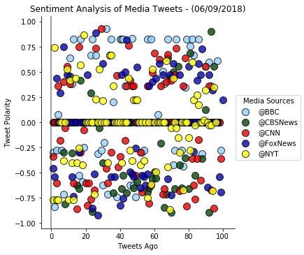
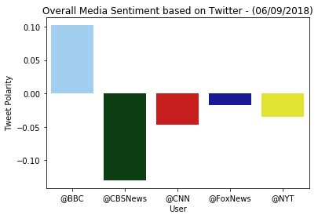

# Analysis

Observed Trend 1: Sentiment Analysis of Media Tweets
               Sentiments cluster around 0.  There seems to be more negative then positive media sentiment.

Observed Trend 2: Overall Media Sentiment based on Twitter
               ON the given day, overall media sentiment is negative for four of the media sources  BBC wqas the only exception having a positive overall media sentiment.  

Observed Trend 3: On the given day, amongst the media sources, media sentiment based on tweets were primarily neutral or negative.


```python
# Dependencies
import tweepy
import numpy as np
import pandas as pd
import csv

import matplotlib.pyplot as plt
import matplotlib
%matplotlib inline
import seaborn as sns

# Import and Initialize Sentiment Analyzer
from vaderSentiment.vaderSentiment import SentimentIntensityAnalyzer
analyzer = SentimentIntensityAnalyzer()

# Twitter API Keys
from config import (consumer_key, 
                    consumer_secret, 
                    access_token, 
                    access_token_secret)

# Setup Tweepy API Authentication
auth = tweepy.OAuthHandler(consumer_key, consumer_secret)
auth.set_access_token(access_token, access_token_secret)
api = tweepy.API(auth, parser=tweepy.parsers.JSONParser())
```


```python
# Target Search Term
target_terms = ("@BBC", "@CBSNews", "@CNN","@FoxNews", "@NYT")


avg_sentiment_list = []
sentiments = []
news_df = pd.DataFrame()

# Loop through all target users
for target in target_terms:
    
    #Counter
    counter = 1

    # Variable for holding the oldest tweet
    oldest_tweet = None

    # Variables for holding sentiments
    compound_list = []
    positive_list = []
    negative_list = []
    neutral_list = []
 
 
 
    # Loop through 5 times
    for x in range(5):

        # Run search around each tweet
        public_tweets = api.search(
            target, count=20, result_type="recent", max_id=oldest_tweet)

        # Loop through all tweets
        for tweet in public_tweets["statuses"]:


           # Run Vader Analysis on each tweet
            results = analyzer.polarity_scores(tweet["text"])
            compound = results["compound"]
            pos = results["pos"]
            neu = results["neu"]
            neg = results["neg"]

           # Add each value to the appropriate list
            compound_list.append(compound)
            positive_list.append(pos)
            negative_list.append(neg)
            neutral_list.append(neu)

            sentiments.append({"Date": tweet["created_at"], 
                           "Compound": compound,
                           "Positive": pos,
                           "Negative": neu,
                           "Neutral": neg,
                           "Media Sources": target,
                           "Tweet"  :  tweet["text"],
                           "Tweets Ago": counter})
        
            # Add to counter 
            counter += 1
                  
            # Set the new oldest_tweet value
            oldest_tweet = tweet["id"] - 1
            
    # Store the Average Sentiments
    avg_sentiment = {
    "User": target,
    "Compound": np.mean(compound_list),
    "Positive": np.mean(positive_list),
    "Neutral": np.mean(negative_list),
    "Negative": np.mean(neutral_list),
    "Tweet Count": len(compound_list)
                }
    avg_sentiment_list.append(avg_sentiment)
    
avg_sentiment_df = pd.DataFrame(avg_sentiment_list).set_index("User").round(3)
avg_sentiment_df.to_csv("avg_sentiments_data.csv")
avg_sentiment_df
```


<div>
<style scoped>
    .dataframe tbody tr th:only-of-type {
        vertical-align: middle;
    }

    .dataframe tbody tr th {
        vertical-align: top;
    }

    .dataframe thead th {
        text-align: right;
    }
</style>
<table border="1" class="dataframe">
  <thead>
    <tr style="text-align: right;">
      <th></th>
      <th>Compound</th>
      <th>Negative</th>
      <th>Neutral</th>
      <th>Positive</th>
      <th>Tweet Count</th>
    </tr>
    <tr>
      <th>User</th>
      <th></th>
      <th></th>
      <th></th>
      <th></th>
      <th></th>
    </tr>
  </thead>
  <tbody>
    <tr>
      <th>@BBC</th>
      <td>0.102</td>
      <td>0.852</td>
      <td>0.054</td>
      <td>0.094</td>
      <td>99</td>
    </tr>
    <tr>
      <th>@CBSNews</th>
      <td>-0.130</td>
      <td>0.857</td>
      <td>0.101</td>
      <td>0.042</td>
      <td>95</td>
    </tr>
    <tr>
      <th>@CNN</th>
      <td>-0.047</td>
      <td>0.843</td>
      <td>0.091</td>
      <td>0.066</td>
      <td>99</td>
    </tr>
    <tr>
      <th>@FoxNews</th>
      <td>-0.018</td>
      <td>0.871</td>
      <td>0.063</td>
      <td>0.066</td>
      <td>100</td>
    </tr>
    <tr>
      <th>@NYT</th>
      <td>-0.035</td>
      <td>0.848</td>
      <td>0.089</td>
      <td>0.062</td>
      <td>96</td>
    </tr>
  </tbody>
</table>
</div>


```python
# Convert sentiments to DataFrame
news_sentiments_df = pd.DataFrame.from_dict(sentiments)
news_sentiments_df = news_sentiments_df[["Date","Media Sources","Compound","Positive","Negative","Neutral","Tweet","Tweets Ago"]]
news_sentiments_df.to_csv("news_sentiments_data.csv")
news_sentiments_df

```


<div>
<style scoped>
    .dataframe tbody tr th:only-of-type {
        vertical-align: middle;
    }

    .dataframe tbody tr th {
        vertical-align: top;
    }

    .dataframe thead th {
        text-align: right;
    }
</style>
<table border="1" class="dataframe">
  <thead>
    <tr style="text-align: right;">
      <th></th>
      <th>Date</th>
      <th>Media Sources</th>
      <th>Compound</th>
      <th>Positive</th>
      <th>Negative</th>
      <th>Neutral</th>
      <th>Tweet</th>
      <th>Tweets Ago</th>
    </tr>
  </thead>
  <tbody>
    <tr>
      <th>0</th>
      <td>Sat Jun 09 11:52:31 +0000 2018</td>
      <td>@BBC</td>
      <td>-0.2960</td>
      <td>0.000</td>
      <td>0.905</td>
      <td>0.095</td>
      <td>can we all decide to tag @CNN @BBC whenever th...</td>
      <td>1</td>
    </tr>
    <tr>
      <th>1</th>
      <td>Sat Jun 09 11:52:17 +0000 2018</td>
      <td>@BBC</td>
      <td>-0.8402</td>
      <td>0.000</td>
      <td>0.679</td>
      <td>0.321</td>
      <td>RT @BBC: 😂 Fashion sense v common sense: the b...</td>
      <td>2</td>
    </tr>
    <tr>
      <th>2</th>
      <td>Sat Jun 09 11:51:51 +0000 2018</td>
      <td>@BBC</td>
      <td>-0.2732</td>
      <td>0.086</td>
      <td>0.784</td>
      <td>0.129</td>
      <td>RT @SteveLawrence_: John Humphrys patronisingl...</td>
      <td>3</td>
    </tr>
    <tr>
      <th>3</th>
      <td>Sat Jun 09 11:51:50 +0000 2018</td>
      <td>@BBC</td>
      <td>0.0772</td>
      <td>0.064</td>
      <td>0.936</td>
      <td>0.000</td>
      <td>@SteveLawrence_ @BBC @BBCr4today Mate. Look cl...</td>
      <td>4</td>
    </tr>
    <tr>
      <th>4</th>
      <td>Sat Jun 09 11:51:33 +0000 2018</td>
      <td>@BBC</td>
      <td>0.0000</td>
      <td>0.000</td>
      <td>1.000</td>
      <td>0.000</td>
      <td>RT @BBC: 😆 @Channing Tatum and @UsainBolt have...</td>
      <td>5</td>
    </tr>
    <tr>
      <th>5</th>
      <td>Sat Jun 09 11:51:28 +0000 2018</td>
      <td>@BBC</td>
      <td>-0.2732</td>
      <td>0.086</td>
      <td>0.784</td>
      <td>0.129</td>
      <td>RT @SteveLawrence_: John Humphrys patronisingl...</td>
      <td>6</td>
    </tr>
    <tr>
      <th>6</th>
      <td>Sat Jun 09 11:51:13 +0000 2018</td>
      <td>@BBC</td>
      <td>-0.7096</td>
      <td>0.000</td>
      <td>0.772</td>
      <td>0.228</td>
      <td>RT @Naijadailyfeed: This is the new way SARS (...</td>
      <td>7</td>
    </tr>
    <tr>
      <th>7</th>
      <td>Sat Jun 09 11:50:49 +0000 2018</td>
      <td>@BBC</td>
      <td>0.0000</td>
      <td>0.000</td>
      <td>1.000</td>
      <td>0.000</td>
      <td>RT @WECF_INT: #FeministFriday suggestion: have...</td>
      <td>8</td>
    </tr>
    <tr>
      <th>8</th>
      <td>Sat Jun 09 11:50:01 +0000 2018</td>
      <td>@BBC</td>
      <td>0.0000</td>
      <td>0.000</td>
      <td>1.000</td>
      <td>0.000</td>
      <td>"There’s a logic to this seething mass of bodi...</td>
      <td>9</td>
    </tr>
    <tr>
      <th>9</th>
      <td>Sat Jun 09 11:49:49 +0000 2018</td>
      <td>@BBC</td>
      <td>0.0000</td>
      <td>0.000</td>
      <td>1.000</td>
      <td>0.000</td>
      <td>RT @BBC: 🌊💙 A message from Sir David Attenboro...</td>
      <td>10</td>
    </tr>
    <tr>
      <th>10</th>
      <td>Sat Jun 09 11:49:42 +0000 2018</td>
      <td>@BBC</td>
      <td>0.6369</td>
      <td>0.219</td>
      <td>0.781</td>
      <td>0.000</td>
      <td>@soapachu @BBC Totally the 2012 Opening Ceremo...</td>
      <td>11</td>
    </tr>
    <tr>
      <th>11</th>
      <td>Sat Jun 09 11:48:48 +0000 2018</td>
      <td>@BBC</td>
      <td>0.3818</td>
      <td>0.163</td>
      <td>0.736</td>
      <td>0.101</td>
      <td>RT @milly4red: #FreeSisikuAyukTabe #freeourlea...</td>
      <td>12</td>
    </tr>
    <tr>
      <th>12</th>
      <td>Sat Jun 09 11:48:46 +0000 2018</td>
      <td>@BBC</td>
      <td>0.8271</td>
      <td>0.293</td>
      <td>0.707</td>
      <td>0.000</td>
      <td>RT @NijaActivist: Finally this Sars Guy got to...</td>
      <td>13</td>
    </tr>
    <tr>
      <th>13</th>
      <td>Sat Jun 09 11:48:29 +0000 2018</td>
      <td>@BBC</td>
      <td>0.0000</td>
      <td>0.000</td>
      <td>1.000</td>
      <td>0.000</td>
      <td>@GStarFreedom @am_draper @Fenbeagle @mike8881 ...</td>
      <td>14</td>
    </tr>
    <tr>
      <th>14</th>
      <td>Sat Jun 09 11:48:24 +0000 2018</td>
      <td>@BBC</td>
      <td>0.0000</td>
      <td>0.000</td>
      <td>1.000</td>
      <td>0.000</td>
      <td>@Fenbeagle @mike8881 @Lin46222208 @Karenco30 @...</td>
      <td>15</td>
    </tr>
    <tr>
      <th>15</th>
      <td>Sat Jun 09 11:48:14 +0000 2018</td>
      <td>@BBC</td>
      <td>-0.5267</td>
      <td>0.102</td>
      <td>0.631</td>
      <td>0.267</td>
      <td>@BryanEastwood2 No Mention of Immigration.\nIt...</td>
      <td>16</td>
    </tr>
    <tr>
      <th>16</th>
      <td>Sat Jun 09 11:48:09 +0000 2018</td>
      <td>@BBC</td>
      <td>0.8271</td>
      <td>0.293</td>
      <td>0.707</td>
      <td>0.000</td>
      <td>RT @NijaActivist: Finally this Sars Guy got to...</td>
      <td>17</td>
    </tr>
    <tr>
      <th>17</th>
      <td>Sat Jun 09 11:47:55 +0000 2018</td>
      <td>@BBC</td>
      <td>-0.5859</td>
      <td>0.000</td>
      <td>0.648</td>
      <td>0.352</td>
      <td>@callmejustsean @RTUKnews @Conservatives @BBC ...</td>
      <td>18</td>
    </tr>
    <tr>
      <th>18</th>
      <td>Sat Jun 09 11:47:32 +0000 2018</td>
      <td>@BBC</td>
      <td>-0.2500</td>
      <td>0.000</td>
      <td>0.920</td>
      <td>0.080</td>
      <td>RT @jizlee: "It would be rather hypocritical t...</td>
      <td>19</td>
    </tr>
    <tr>
      <th>19</th>
      <td>Sat Jun 09 11:47:17 +0000 2018</td>
      <td>@BBC</td>
      <td>0.0000</td>
      <td>0.000</td>
      <td>1.000</td>
      <td>0.000</td>
      <td>RT @BBC: 🌊💙 A message from Sir David Attenboro...</td>
      <td>20</td>
    </tr>
    <tr>
      <th>20</th>
      <td>Sat Jun 09 11:47:15 +0000 2018</td>
      <td>@BBC</td>
      <td>0.0000</td>
      <td>0.000</td>
      <td>1.000</td>
      <td>0.000</td>
      <td>RT @BBC: 🌊💙 A message from Sir David Attenboro...</td>
      <td>21</td>
    </tr>
    <tr>
      <th>21</th>
      <td>Sat Jun 09 11:47:12 +0000 2018</td>
      <td>@BBC</td>
      <td>0.0000</td>
      <td>0.000</td>
      <td>1.000</td>
      <td>0.000</td>
      <td>@welt @ZDF @WDR @BBC @nytimes @CNN @lemonde_fr...</td>
      <td>22</td>
    </tr>
    <tr>
      <th>22</th>
      <td>Sat Jun 09 11:47:12 +0000 2018</td>
      <td>@BBC</td>
      <td>0.6705</td>
      <td>0.193</td>
      <td>0.807</td>
      <td>0.000</td>
      <td>RT @martycon73: New poll out this morning for ...</td>
      <td>23</td>
    </tr>
    <tr>
      <th>23</th>
      <td>Sat Jun 09 11:47:06 +0000 2018</td>
      <td>@BBC</td>
      <td>0.8271</td>
      <td>0.293</td>
      <td>0.707</td>
      <td>0.000</td>
      <td>RT @NijaActivist: Finally this Sars Guy got to...</td>
      <td>24</td>
    </tr>
    <tr>
      <th>24</th>
      <td>Sat Jun 09 11:47:01 +0000 2018</td>
      <td>@BBC</td>
      <td>0.0000</td>
      <td>0.000</td>
      <td>1.000</td>
      <td>0.000</td>
      <td>RT @BBC: 😆 @Channing Tatum and @UsainBolt have...</td>
      <td>25</td>
    </tr>
    <tr>
      <th>25</th>
      <td>Sat Jun 09 11:46:57 +0000 2018</td>
      <td>@BBC</td>
      <td>0.6705</td>
      <td>0.193</td>
      <td>0.807</td>
      <td>0.000</td>
      <td>RT @martycon73: New poll out this morning for ...</td>
      <td>26</td>
    </tr>
    <tr>
      <th>26</th>
      <td>Sat Jun 09 11:46:14 +0000 2018</td>
      <td>@BBC</td>
      <td>-0.3089</td>
      <td>0.000</td>
      <td>0.852</td>
      <td>0.148</td>
      <td>RT @BBC: 'If the oceans don't stay healthy, hu...</td>
      <td>27</td>
    </tr>
    <tr>
      <th>27</th>
      <td>Sat Jun 09 11:46:09 +0000 2018</td>
      <td>@BBC</td>
      <td>0.0000</td>
      <td>0.000</td>
      <td>1.000</td>
      <td>0.000</td>
      <td>@welt @ZDF @WDR @BBC @nytimes @CNN @lemonde_fr...</td>
      <td>28</td>
    </tr>
    <tr>
      <th>28</th>
      <td>Sat Jun 09 11:45:52 +0000 2018</td>
      <td>@BBC</td>
      <td>-0.2732</td>
      <td>0.086</td>
      <td>0.784</td>
      <td>0.129</td>
      <td>RT @SteveLawrence_: John Humphrys patronisingl...</td>
      <td>29</td>
    </tr>
    <tr>
      <th>29</th>
      <td>Sat Jun 09 11:45:12 +0000 2018</td>
      <td>@BBC</td>
      <td>-0.6249</td>
      <td>0.000</td>
      <td>0.661</td>
      <td>0.339</td>
      <td>RT @KaptanHindustan: The Venezuelan economic c...</td>
      <td>30</td>
    </tr>
    <tr>
      <th>...</th>
      <td>...</td>
      <td>...</td>
      <td>...</td>
      <td>...</td>
      <td>...</td>
      <td>...</td>
      <td>...</td>
      <td>...</td>
    </tr>
    <tr>
      <th>459</th>
      <td>Fri Jun 08 23:06:50 +0000 2018</td>
      <td>@NYT</td>
      <td>0.6124</td>
      <td>0.167</td>
      <td>0.833</td>
      <td>0.000</td>
      <td>Noting of course how the media scrum is silent...</td>
      <td>67</td>
    </tr>
    <tr>
      <th>460</th>
      <td>Fri Jun 08 22:56:58 +0000 2018</td>
      <td>@NYT</td>
      <td>-0.4404</td>
      <td>0.000</td>
      <td>0.775</td>
      <td>0.225</td>
      <td>RT @NYT: With Mueller Closing In, Manafort’s A...</td>
      <td>68</td>
    </tr>
    <tr>
      <th>461</th>
      <td>Fri Jun 08 22:56:29 +0000 2018</td>
      <td>@NYT</td>
      <td>-0.8625</td>
      <td>0.000</td>
      <td>0.650</td>
      <td>0.350</td>
      <td>"How Suicide Quietly Morphed Into a Public Hea...</td>
      <td>69</td>
    </tr>
    <tr>
      <th>462</th>
      <td>Fri Jun 08 22:42:02 +0000 2018</td>
      <td>@NYT</td>
      <td>-0.0516</td>
      <td>0.000</td>
      <td>0.882</td>
      <td>0.118</td>
      <td>Pixar Co-Founder to Leave Disney After ‘Misste...</td>
      <td>70</td>
    </tr>
    <tr>
      <th>463</th>
      <td>Fri Jun 08 22:39:07 +0000 2018</td>
      <td>@NYT</td>
      <td>0.4404</td>
      <td>0.195</td>
      <td>0.805</td>
      <td>0.000</td>
      <td>#DontJustSitThereDoSomething NY Times | A Year...</td>
      <td>71</td>
    </tr>
    <tr>
      <th>464</th>
      <td>Fri Jun 08 22:33:54 +0000 2018</td>
      <td>@NYT</td>
      <td>0.0000</td>
      <td>0.000</td>
      <td>1.000</td>
      <td>0.000</td>
      <td>RT @NYT: G-7, Manafort, Bourdain: Your Friday ...</td>
      <td>72</td>
    </tr>
    <tr>
      <th>465</th>
      <td>Fri Jun 08 22:19:11 +0000 2018</td>
      <td>@NYT</td>
      <td>-0.0516</td>
      <td>0.000</td>
      <td>0.930</td>
      <td>0.070</td>
      <td>"Pixar Co-Founder to Leave Disney After ‘Misst...</td>
      <td>73</td>
    </tr>
    <tr>
      <th>466</th>
      <td>Fri Jun 08 22:15:28 +0000 2018</td>
      <td>@NYT</td>
      <td>-0.1531</td>
      <td>0.000</td>
      <td>0.849</td>
      <td>0.151</td>
      <td>RT @NYT: Rebel in the Kitchen: Remembering Ant...</td>
      <td>74</td>
    </tr>
    <tr>
      <th>467</th>
      <td>Fri Jun 08 22:14:37 +0000 2018</td>
      <td>@NYT</td>
      <td>-0.2944</td>
      <td>0.000</td>
      <td>0.886</td>
      <td>0.114</td>
      <td>@TheEconomist @NewsJunkie60 Trump is proving t...</td>
      <td>75</td>
    </tr>
    <tr>
      <th>468</th>
      <td>Fri Jun 08 22:13:45 +0000 2018</td>
      <td>@NYT</td>
      <td>0.0000</td>
      <td>0.000</td>
      <td>1.000</td>
      <td>0.000</td>
      <td>RT @NYT: Bill Cunningham’s Unseen Scrapbooks. ...</td>
      <td>76</td>
    </tr>
    <tr>
      <th>469</th>
      <td>Fri Jun 08 22:11:07 +0000 2018</td>
      <td>@NYT</td>
      <td>-0.6696</td>
      <td>0.000</td>
      <td>0.732</td>
      <td>0.268</td>
      <td>@politico Chao, in becoming a petty criminal, ...</td>
      <td>77</td>
    </tr>
    <tr>
      <th>470</th>
      <td>Fri Jun 08 22:08:11 +0000 2018</td>
      <td>@NYT</td>
      <td>0.0000</td>
      <td>0.000</td>
      <td>1.000</td>
      <td>0.000</td>
      <td>RT @NYT: Letters to the Editor. https://t.co/9...</td>
      <td>78</td>
    </tr>
    <tr>
      <th>471</th>
      <td>Fri Jun 08 22:06:44 +0000 2018</td>
      <td>@NYT</td>
      <td>0.0000</td>
      <td>0.000</td>
      <td>1.000</td>
      <td>0.000</td>
      <td>@realDonaldTrump A President who doesn't get i...</td>
      <td>79</td>
    </tr>
    <tr>
      <th>472</th>
      <td>Fri Jun 08 22:03:12 +0000 2018</td>
      <td>@NYT</td>
      <td>-0.1531</td>
      <td>0.000</td>
      <td>0.849</td>
      <td>0.151</td>
      <td>RT @NYT: Rebel in the Kitchen: Remembering Ant...</td>
      <td>80</td>
    </tr>
    <tr>
      <th>473</th>
      <td>Fri Jun 08 22:00:25 +0000 2018</td>
      <td>@NYT</td>
      <td>-0.2732</td>
      <td>0.112</td>
      <td>0.695</td>
      <td>0.193</td>
      <td>@NYT @politico @BuzzFeed Good point about all ...</td>
      <td>81</td>
    </tr>
    <tr>
      <th>474</th>
      <td>Fri Jun 08 21:54:54 +0000 2018</td>
      <td>@NYT</td>
      <td>0.5994</td>
      <td>0.358</td>
      <td>0.642</td>
      <td>0.000</td>
      <td>RT @NYT: Why Cooks Loved Anthony Bourdain. htt...</td>
      <td>82</td>
    </tr>
    <tr>
      <th>475</th>
      <td>Fri Jun 08 21:53:22 +0000 2018</td>
      <td>@NYT</td>
      <td>0.2263</td>
      <td>0.106</td>
      <td>0.894</td>
      <td>0.000</td>
      <td>RT @NYT: That Decisive Moment: June Is Bustin’...</td>
      <td>83</td>
    </tr>
    <tr>
      <th>476</th>
      <td>Fri Jun 08 21:47:25 +0000 2018</td>
      <td>@NYT</td>
      <td>-0.0258</td>
      <td>0.108</td>
      <td>0.780</td>
      <td>0.112</td>
      <td>RT @RealPirateShip: What do you do when a frie...</td>
      <td>84</td>
    </tr>
    <tr>
      <th>477</th>
      <td>Fri Jun 08 21:33:15 +0000 2018</td>
      <td>@NYT</td>
      <td>0.2732</td>
      <td>0.214</td>
      <td>0.636</td>
      <td>0.150</td>
      <td>RT @NYT: How the Hockey Team in Las Vegas Won ...</td>
      <td>85</td>
    </tr>
    <tr>
      <th>478</th>
      <td>Fri Jun 08 21:27:29 +0000 2018</td>
      <td>@NYT</td>
      <td>0.1779</td>
      <td>0.248</td>
      <td>0.560</td>
      <td>0.192</td>
      <td>Some real winners working for Holocaust denyin...</td>
      <td>86</td>
    </tr>
    <tr>
      <th>479</th>
      <td>Fri Jun 08 21:22:28 +0000 2018</td>
      <td>@NYT</td>
      <td>0.0000</td>
      <td>0.000</td>
      <td>1.000</td>
      <td>0.000</td>
      <td>RT @davidmiller631: @almostjingo @SenFeinstein...</td>
      <td>87</td>
    </tr>
    <tr>
      <th>480</th>
      <td>Fri Jun 08 21:22:25 +0000 2018</td>
      <td>@NYT</td>
      <td>0.0000</td>
      <td>0.000</td>
      <td>1.000</td>
      <td>0.000</td>
      <td>@NYT https://t.co/WmWDXQizHh</td>
      <td>88</td>
    </tr>
    <tr>
      <th>481</th>
      <td>Fri Jun 08 21:17:31 +0000 2018</td>
      <td>@NYT</td>
      <td>0.0258</td>
      <td>0.084</td>
      <td>0.836</td>
      <td>0.080</td>
      <td>RT @libertytarian: @CNN @NYT &amp;amp; #MSM also f...</td>
      <td>89</td>
    </tr>
    <tr>
      <th>482</th>
      <td>Fri Jun 08 21:16:34 +0000 2018</td>
      <td>@NYT</td>
      <td>0.3182</td>
      <td>0.173</td>
      <td>0.827</td>
      <td>0.000</td>
      <td>RT @NYT: Fiction: Clarice Lispector’s Second N...</td>
      <td>90</td>
    </tr>
    <tr>
      <th>483</th>
      <td>Fri Jun 08 21:16:12 +0000 2018</td>
      <td>@NYT</td>
      <td>0.0000</td>
      <td>0.000</td>
      <td>1.000</td>
      <td>0.000</td>
      <td>RT @davidmiller631: @almostjingo @SenFeinstein...</td>
      <td>91</td>
    </tr>
    <tr>
      <th>484</th>
      <td>Fri Jun 08 21:14:53 +0000 2018</td>
      <td>@NYT</td>
      <td>-0.0258</td>
      <td>0.108</td>
      <td>0.780</td>
      <td>0.112</td>
      <td>RT @RealPirateShip: What do you do when a frie...</td>
      <td>92</td>
    </tr>
    <tr>
      <th>485</th>
      <td>Fri Jun 08 21:13:30 +0000 2018</td>
      <td>@NYT</td>
      <td>-0.0258</td>
      <td>0.108</td>
      <td>0.780</td>
      <td>0.112</td>
      <td>RT @RealPirateShip: What do you do when a frie...</td>
      <td>93</td>
    </tr>
    <tr>
      <th>486</th>
      <td>Fri Jun 08 21:03:20 +0000 2018</td>
      <td>@NYT</td>
      <td>-0.6800</td>
      <td>0.000</td>
      <td>0.790</td>
      <td>0.210</td>
      <td>RT @chachmalone: @hale_razor NYTs need someone...</td>
      <td>94</td>
    </tr>
    <tr>
      <th>487</th>
      <td>Fri Jun 08 20:58:59 +0000 2018</td>
      <td>@NYT</td>
      <td>0.3455</td>
      <td>0.265</td>
      <td>0.528</td>
      <td>0.207</td>
      <td>@LisaMei62 Honestly this just embarrassing to ...</td>
      <td>95</td>
    </tr>
    <tr>
      <th>488</th>
      <td>Fri Jun 08 20:56:55 +0000 2018</td>
      <td>@NYT</td>
      <td>0.0000</td>
      <td>0.000</td>
      <td>1.000</td>
      <td>0.000</td>
      <td>RT @roryslife: @SaysSimonson @DailyCaller So b...</td>
      <td>96</td>
    </tr>
  </tbody>
</table>
<p>489 rows × 8 columns</p>
</div>


```python
#Get Data for Plot
#Sentiment Analysis of Media Tweets
# Create a path to the News Sentiment Data csv and read it into a Pandas DataFrame
csv_path = "news_sentiments_data.csv"
news_sentiment_plt_data_df = pd.read_csv(csv_path)

with open(csv_path, newline='') as csvfile:

    # CSV reader specifies delimiter and variable that holds contents
    csvreader = csv.reader(csv_path, delimiter=',')
    # Skip the Headers
    next(csvreader,None)
colors=["xkcd:light blue","xkcd:forest green","xkcd:red","xkcd:royal blue","xkcd:yellow"]    
sns.lmplot('Tweets Ago', 'Compound', news_sentiment_plt_data_df,fit_reg=False,hue = 'Media Sources',
palette=colors,scatter_kws={"marker":"o","s":100,"edgecolor":"k"})
plt.title("Sentiment Analysis of Media Tweets - (06/09/2018)")
plt.xlabel("Tweets Ago")
plt.ylabel("Tweet Polarity")
plt.axvline(0, color="black",alpha=0.5)
plt.savefig("Sentiment Analysis")
plt.show()
```





```python
#Get Data for Plot

# Create a path to the Average Sentiments Data csv and read it into a Pandas DataFrame
csv_path = "avg_sentiments_data.csv"
avg_sentiments_plt_data_df = pd.read_csv(csv_path)

with open(csv_path, newline='') as csvfile:

    # CSV reader specifies delimiter and variable that holds contents
    csvreader = csv.reader(csv_path, delimiter=',')
    # Skip the Headers
    next(csvreader,None)
    
colors=["xkcd:light blue","xkcd:forest green","xkcd:red","xkcd:royal blue","xkcd:yellow"]    
sns.barplot(x='User', y='Compound', data=avg_sentiments_plt_data_df,palette=colors)
plt.title("Overall Media Sentiment based on Twitter - (06/09/2018)")
plt.ylabel("Tweet Polarity")
plt.savefig("Overall Sentiment")
plt.show()
```




